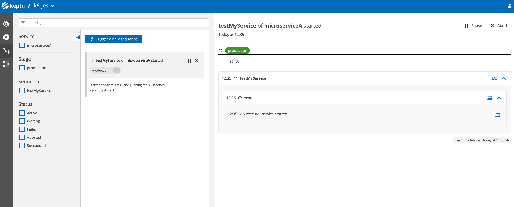

# K6 - Job Executor Service Demo

This tutorial will use Job Executor Service to execute K6 performance testing in a Keptn project.

## Setup

### Install Keptn 

Setup Keptn from [quickstart guide](https://keptn.sh/docs/quickstart/)

### Install Job Executor Service

The Job Executor Service can be installed using this command

```
JES_VERSION="0.2.0"
JES_NAMESPACE="keptn-jes"
TASK_SUBSCRIPTION="sh.keptn.event.remote-passing-task.triggered\,sh.keptn.event.remote-failing-task.triggered" # Events used in current tutorial

helm upgrade --install --create-namespace -n ${JES_NAMESPACE} \
  job-executor-service "https://github.com/keptn-contrib/job-executor-service/releases/download/${JES_VERSION}/job-executor-service-${JES_VERSION}.tgz" \
 --set remoteControlPlane.autoDetect.enabled="true",remoteControlPlane.topicSubscription="${TASK_SUBSCRIPTION}",remoteControlPlane.api.token="",remoteControlPlane.api.hostname="",remoteControlPlane.api.protocol=""
```

For more information regarding latest version of Job Executor Service, follow this [Link](https://github.com/keptn-contrib/job-executor-service#install-job-executor-service). In this tutorial, the Job Executor Service should listen to `sh.keptn.event.remote-passing-task.triggered` and `sh.keptn.event.remote-failing-task.triggered` CloudEvents, which can be configured in shipyard file too. 

## Creating Project

Create a new Keptn project using the following command

```
keptn create project k6-jes --shipyard=./shipyard.yaml --git-user=<GIT_USER> --git-token=<GIT_TOKEN> --git-remote-url=<UNINTIALIZED_GIT_REPO_URL>
```

This command will create the project `k6-jes` and in the mentioned `GIT_REPO`, have `shipyard.yaml` file in master branch and initialize the `production` branch based on the stage mentioned in the [file](./shipyard.yaml). 

## Creating Service

Create a `k6-pass` and `k6-fail` service using the command

```
keptn create service k6-pass --project k6-jes -y

keptn create service k6-fail --project k6-jes -y
```

This command will create a `k6-pass` service and `k6-fail` service. Both of them will have a job config files for K6 testing. For tutorial purpose only, `k6-pass` will have a passing K6 threshold test file and `k6-fail` will have a failing K6 threshold test. 

## Adding Resources

Next, we'll add config files for both our serives using the commands

- For `k6-pass`

```
keptn add-resource --project k6-jes --service k6-pass --stage production --resource ./production/k6-pass/job/config.yaml --resourceUri job/config.yaml

keptn add-resource --project k6-jes --service k6-pass --stage production --resource ./production/k6-pass/k6_pass_files/passing_threshold.js --resourceUri k6_pass_files/passing_threshold.js
```

- For `k6-fail`

```
keptn add-resource --project k6-jes --service k6-fail --stage production --resource ./production/k6-fail/job/config.yaml --resourceUri job/config.yaml

keptn add-resource --project k6-jes --service k6-fail --stage production --resource ./production/k6-fail/k6_fail_files/failing_threshold.js --resourceUri k6_fail_files/failing_threshold.js
```

This will add `config.yaml` and K6 test files to the `production` branh on `GIT_REPO`. 

> \* Make sure the resources have been added successfully to the git repo for execution of test *

## Understanding Resources

### Config

The `config.yaml` for `k6-pass` and `k6-fail` looks like 

```yaml
apiVersion: v2
actions:
  - name: "Run k6"
    events:
      - name: "sh.keptn.event.remote-passing-task.triggered"
    tasks:
      - name: "Run k6 with Keptn"
        files:
          - /k6_pass_files
        image: "loadimpact/k6"
        cmd: ["k6"]
        args: ["run", "--duration", "30s", "--vus", "10", "/keptn/k6_pass_files/passing_threshold.js"]
```

K6 docker image is pulled from `loadimpact/k6` and used for execution using the `k6 run` command. The file mentioned would be accessible from `/keptn/<resource-uri>`

Any custom K6 Docker image could be used here, along with K6 binary created using K6 extensions. A common example would be [xk6-output-prometheus-remote](https://github.com/grafana/xk6-output-prometheus-remote). 

### K6 files

Simple K6 test files are used here 

```js
import http from 'k6/http';

export const options = {
  thresholds: {
    http_req_failed: ['rate<0.01'], // http errors should be less than 1%
    http_req_duration: ['p(95)<500'], // 95% of requests should be below 500ms
  },
};

export default function () {
  http.get('https://test-api.k6.io/public/crocodiles/1/');
}
```

This file would be used for K6 performance testing. The `http_req_duration` would pass and fail in corresponding services.

## Trigger Sequence

Let's trigger the sequences using the command 

```
keptn trigger sequence --sequence k6-pass-seq --project k6-jes --service k6-pass --stage production

keptn trigger sequence --sequence k6-fail-seq --project k6-jes --service k6-fail --stage production
```

You can trigger the sequence from Keptn Bridge.

### Success Trigger

The Sequence has been successfully triggered can be seen by the log of `job-executor-service started` in the below image



### K6-Pass Service

The `k6-pass` service will execute with a `zero exit code` so, it will be finished successfully. We can view the logs given by k6 run command.


### K6-Fail Service

The `k6-fail` service will execute with a `non-zero exit code` so, it will be finished as failure.


## Debug

- Make sure the resouces are in the correct location. You can use this repo as reference - [jainammm/keptn-k6-jes-tutorial](https://github.com/jainammm/keptn-k6-jes-tutorial)
- View the logs of Job Executor Service from using the command

```
kubectl -n keptn-jes logs deployment/job-executor-service -f job-executor-service
```

## Demo Link

- The Demo Link to this tutorial can be found here - [YouTube](https://www.youtube.com/watch?v=MtjbvnDbhP8)