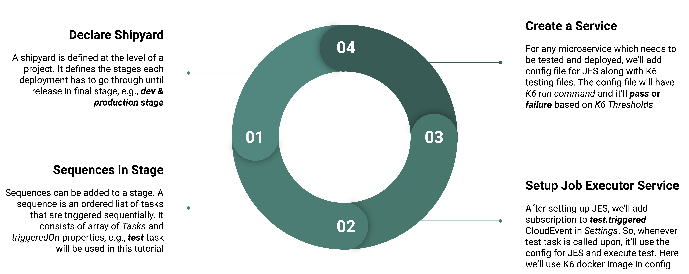

# Performance Testing in Keptn using K6 [Part - 1]

This tutorial will use Job Executor Service to execute K6 performance testing in a Keptn project. We'll start with running a K6 script and how the logs look. And then we'll modify the K6 script to see the behaviour when it fails.

## What is Keptn?

Keptn is an event-driven orchestration engine that connects observability with operations in cloud-native applications. The project uses a declarative approach to build scalable automation for delivery and operations, evaluates Service Level Indicators (SLOs), and provides a dashboard, alerts, and auto-remediation for them. It allows us to define multi-stage delivery pipelines declaratively. 

Keptn allows you to pick a use case and automate & integrate it in a more general way. Depending on the use case, you bring a configuration. For instance: 
1. Quality Gates <> SLI/SLO config 
2. Progressive Delivery <> Shipyard file
3. Remediation <> Runbook for fixing systems

## Keptn Job Executor Service & K6 Test Workflow

This will the workflow of events in this tutorial.



## Setup

### Install Keptn 

Setup Keptn from the [quickstart guide](https://keptn.sh/docs/quickstart/)

### Install Job Executor Service

The Job Executor Service can be installed using this command

```
JES_VERSION="0.2.0"
JES_NAMESPACE="keptn-jes"
TASK_SUBSCRIPTION="sh.keptn.event.test.triggered" # Events used in current tutorial

helm upgrade --install --create-namespace -n ${JES_NAMESPACE} \
  job-executor-service "https://github.com/keptn-contrib/job-executor-service/releases/download/${JES_VERSION}/job-executor-service-${JES_VERSION}.tgz" \
 --set remoteControlPlane.autoDetect.enabled="true",remoteControlPlane.topicSubscription="${TASK_SUBSCRIPTION}",remoteControlPlane.api.token="",remoteControlPlane.api.hostname="",remoteControlPlane.api.protocol=""
```

For more information regarding latest version of Job Executor Service, follow this [Link](https://github.com/keptn-contrib/job-executor-service#install-job-executor-service). In this tutorial, the Job Executor Service should listen to `sh.keptn.event.test.triggered` CloudEvent, which can be configured in shipyard file. 

> If you have Job Executor Service installed already, please directly subscribe to `sh.keptn.event.test.triggered` event from Bridge after creating Keptn Project.

## Creating Project

Create a new Keptn project using the following command

```
keptn create project k6-jes --shipyard=./shipyard.yaml --git-user=<GIT_USER> --git-token=<GIT_TOKEN> --git-remote-url=<UNINTIALIZED_GIT_REPO_URL>
```

This command will create the project `k6-jes` and in the mentioned `GIT_REPO`, have a `shipyard.yaml` file in the `master` branch and initialize the `production` branch based on the stage mentioned in the [file](./shipyard.yaml). 

## Creating Service

Create a `microserviceA` service using the command

```
keptn create service microserviceA --project k6-jes -y
```

This command will create a `microserviceA` service. It will have a job config file for the K6 testing command and file path. 

## Adding Resources

Next, we'll add config files for `microserviceA` serives using the commands

```
keptn add-resource --project k6-jes --service microserviceA --stage production --resource ./production/microserviceA/job/config.yaml --resourceUri job/config.yaml

keptn add-resource --project k6-jes --service microserviceA --stage production --resource ./production/microserviceA/files/k6_test.js --resourceUri files/k6_test.js
```

This will add `config.yaml` and K6 test file to the `production` branch on `GIT_REPO`. 

> \* Make sure the resources have been added successfully to the git repo for the execution of test *

## Understanding Resources

### Config

The `config.yaml` for service `microserviceA` looks like 

```yaml
apiVersion: v2
actions:
  - name: "Run k6"
    events:
      - name: "sh.keptn.event.test.triggered"
    tasks:
      - name: "Run k6 with Keptn"
        files:
          - /files
        image: "loadimpact/k6"
        cmd: ["k6"]
        args: ["run", "--duration", "30s", "--vus", "10", "/keptn/files/k6_test.js"]
```

K6 docker image is pulled from `loadimpact/k6` and used for execution using the `k6 run` command. The file mentioned would be accessible from `/keptn/<resource-uri>`

Any custom K6 Docker image could be used here, along with K6 binary created using K6 extensions. A common example would be [xk6-output-prometheus-remote](https://github.com/grafana/xk6-output-prometheus-remote). We'll take a look at K6 extensions in the [next tutorial](../k6-prometheus-example/README.md)

### K6 files

Simple K6 test files are used here 

```js
import http from 'k6/http';

export const options = {
  thresholds: {
    http_req_failed: ['rate<0.01'], // http errors should be less than 1%
    http_req_duration: ['p(95)<500'], // 95% of requests should be below 500ms
  },
};

export default function () {
  http.get('https://test-api.k6.io/public/crocodiles/1/');
}
```

This file would be used for K6 performance testing. 

## Trigger Sequence

Let's trigger the sequence using the command 

```
keptn trigger sequence --sequence testMyService --project k6-jes --service microserviceA --stage production
```

You can trigger the sequence from Keptn Bridge too.

### Success Trigger

The Sequence has been successfully triggered can be seen by the log of `job-executor-service started` in the below image


### K6 Execution Logs

The `microserviceA` service will execute with a `zero exit code`, therefore it will be finished successfully. We can view the logs given by the k6 run command.


## Failing K6 Test

We'll see how the service fails when the K6 performance testing fails. In `k6_test.js` file, we'll change the threshold from `500ms` to `5ms`... Forcing it to fail!

```js
export const options = {
  thresholds: {
    http_req_failed: ['rate<0.01'], // http errors should be less than 1%
    http_req_duration: ['p(95)<5'], // 95% of requests should be below 5ms... Force Fail :)
  },
};
```

We'll have to update the resources on ***Git Upstream***. You can do that manually in the `production` branch or by using this command

```
keptn add-resource --project k6-jes --service microserviceA --stage production --resource ./production/microserviceA/files/k6_test_fail.js --resourceUri files/k6_test.js
```

Here, the `k6_test_fail.js` will replace the `k6_test.js` in the Git repo.

### Trigger Sequence Again

Let's re-run the Service using the same command to trigger the sequence 

```
keptn trigger sequence --sequence testMyService --project k6-jes --service microserviceA --stage production
```

### K6 Fail Logs

Due to the change in the K6 test script, now the service `microserviceA` will execute with a `non-zero exit code`, hence it will be finished as a failure. 


## Debug

- Make sure the resources are in the correct location. You can use this repo as a reference - [jainammm/keptn-k6-jes-tutorial](https://github.com/jainammm/keptn-k6-jes-tutorial)
- View the logs of Job Executor Service by using the command

```
kubectl -n keptn-jes logs deployment/job-executor-service -f job-executor-service
```

## Demo Link

- The Demo Link to this tutorial can be found here - [YouTube](https://www.youtube.com/watch?v=MtjbvnDbhP8)

## Next Tutorial

Please follow the [next tutorial](../k6-prometheus-example/README.md) for running K6 Extension (Prometheus Output) in Job Executor Service.